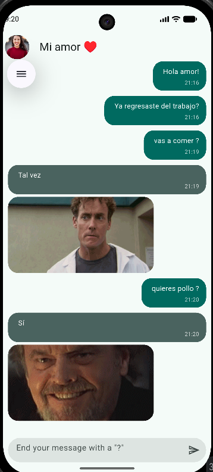
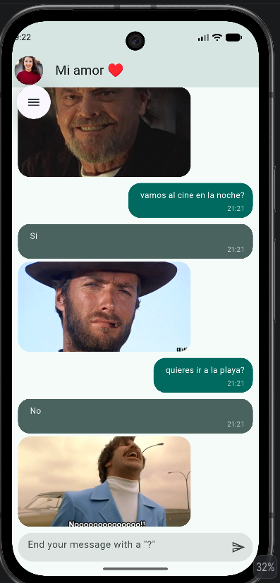
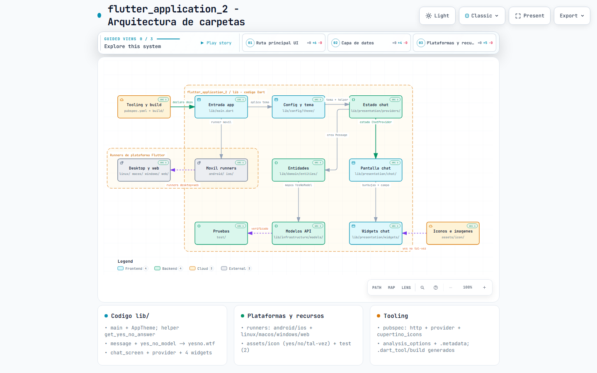
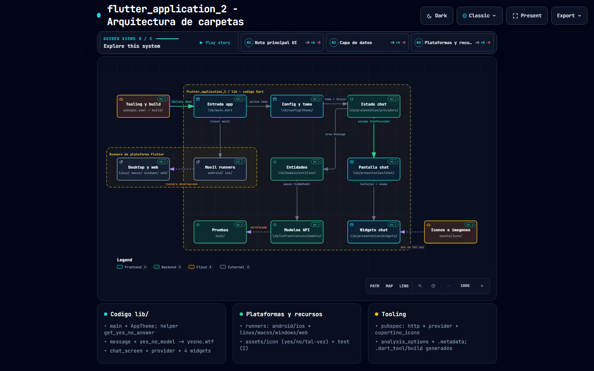

# Práctica 3: Aplicación Móvil en Flutter (Yes No App)

## Nombre de la Práctica
**Desarrollo de Aplicación Móvil de Chat Interactivo "Yes No App" con Integración de API REST, Gestión de Estado con Provider y Reutilización de Componentes**

---

###  Diagrama de Arquitectura
- 🌐 **[Ver Diagrama Interactivo de Arquitectura en GitHub Pages](https://giova0412.github.io/mkdir-Practicas_DMI_230314/Practica03/flutter_application_2/docs/arquitectura-flutter-application-2.html)**

---

## Descripción de la Práctica
Esta práctica consiste en el desarrollo de una aplicación móvil de chat en **Flutter** para la materia de *Desarrollo Móvil Integral (DMI)*. 

La aplicación simula una conversación de chat interactiva ("Yes No App") donde el usuario puede escribir y enviar mensajes. Cuando una pregunta termina con un signo de interrogación (`?`), la aplicación realiza una petición HTTP asíncrona a la API REST pública `yesno.wtf` para obtener una respuesta automática que incluye una decisión (*yes*, *no*, *maybe*) y una imagen/GIF animado correspondiente.

Principales características implementadas:
- **Gestión de Estado Global:** Implementada mediante el patrón **Provider** (`ChangeNotifierProvider` y `ChatProvider`) para reaccionar a cambios en la lista de mensajes de forma reactiva.
- **Arquitectura Limpia (Clean Architecture):** Separación adecuada en capas (`domain`, `infrastructure`, `presentation`, `config`).
- **Mapeo de Datos (Mapper & Model):** Conversión de respuestas JSON obtenidas mediante peticiones `http` a entidades del dominio (`YesNoModel` -> `Message`).
- **Desplazamiento Automático:** Animación del scroll (`ScrollController`) hacia el último mensaje enviado o recibido.
- **Widgets Reutilizables:** Componentes personalizados como `MyMessageBubble`, `HerMessageBubble`, `MessageFieldBox` y `MessageTimeLabel`.

---

## Objetivo de la Práctica
- Comprender el manejo del estado global dinámico en Flutter utilizando el paquete `provider`.
- Aplicar la arquitectura limpia mediante el desacoplamiento de la lógica de negocio, datos de infraestructura y la interfaz de usuario.
- Integrar peticiones HTTP asíncronas con el paquete `http` y consumir APIs REST de terceros (`yesno.wtf`).
- Crear componentes visuales reutilizables para chats interactivos y controlar el desplazamiento automático con `ScrollController`.

---

## Resultados Obtenidos

A continuación se presentan las capturas de pantalla de las imágenes/respuestas de la aplicación y las vistas del diagrama de arquitectura:

### 1. Logo de la Aplicación

### 2. Respuestas de la API (Yes / No / Tal Vez)

---

### 3. Diagramas de Arquitectura

