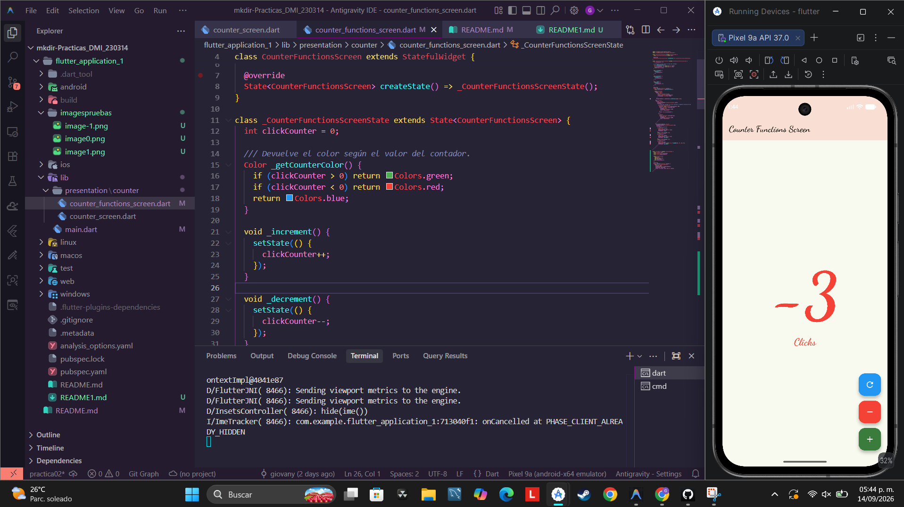
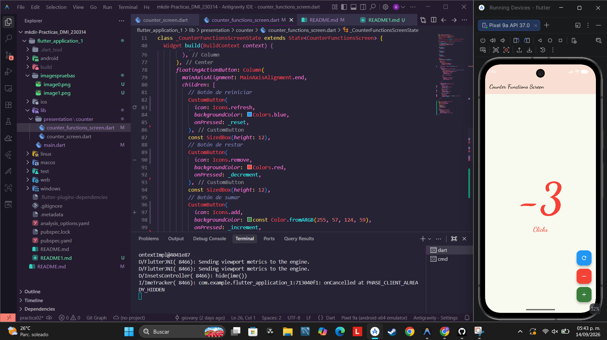
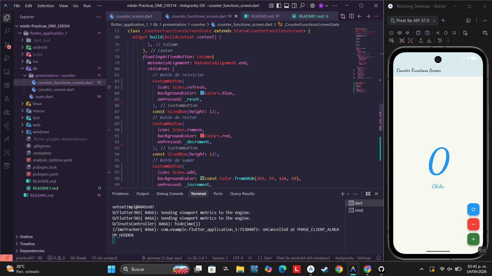
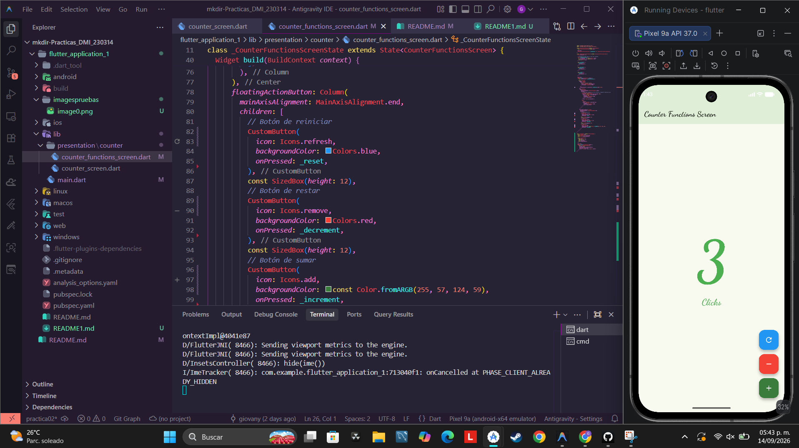

# Práctica 1: Aplicación Contador en Flutter (Counter Functions)

## Nombre de la Práctica
**Desarrollo de Aplicación Contador con Funciones Extendidas y Reutilización de Componentes (CustomButton)**

---

## Descripción de la Práctica
Esta práctica consiste en el desarrollo de una aplicación móvil en **Flutter** para la materia de *Desarrollo Móvil Integral (DMI)*. 

La aplicación muestra un contador interactivo en pantalla que permite:
- **Incrementar** el contador en 1 unidad.
- **Decrementar** el contador en 1 unidad.
- **Reiniciar** el contador a 0.

Además, incluye cambios dinámicos de interfaz como la variación de color en el texto y la barra superior según el valor actual del contador (verde para valores positivos, rojo para valores negativos y azul para cero), utilizando la tipografía personalizada *Dancing Script* a través del paquete `google_fonts`.

Los botones flotantes de acción se refactorizaron aplicando conceptos de **polimorfismo y reutilización de componentes en POO**, creando un único widget personalizado denominado `CustomButton`.

---

## Objetivo de la Práctica
- Comprender el manejo del estado dinámico en Flutter utilizando `StatefulWidget` y la función `setState()`.
- Implementar buenas prácticas de arquitectura de software mediante la extracción de widgets reutilizables (`CustomButton`).
- Aplicar diseño de interfaz dinámico ajustando estilos, colores y fuentes dinámicamente según el estado de la aplicación.
- Configurar y hacer uso de paquetes externos en Flutter (`google_fonts`).

---

## Resultados Obtenidos

A continuación se presentan las capturas de pantalla de la aplicación en funcionamiento y la estructura del código implementado:

### 1. Código Fuente y Estructura

### 2. Contador en Valor Negativo (-1)

### 3. Contador en Estado Inicial (0)

y
### 4. Contador en Valor Positivo (+1)

